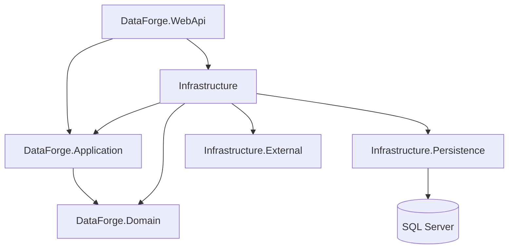

# DataForge

> A production-style .NET 9 reference project focused on mastering Entity Framework Core 9, relational database design, querying, and backend performance.


## Overview

**DataForge** is an educational backend project built to explore Entity Framework Core beyond basic CRUD operations.

The project focuses on understanding how EF Core interacts with a relational database in realistic backend scenarios, including:

- Relational modeling
- Entity configuration
- Migrations
- Change tracking
- Querying
- Query optimization
- Transactions
- Concurrency
- Database performance
- Testing persistence behavior

Rather than introducing unnecessary architectural complexity, DataForge intentionally keeps the business domain relatively small so the main focus remains on **EF Core and database behavior**.

The project is currently under active development.

## Goals

The primary goal of DataForge is to build a strong practical understanding of EF Core and relational database concepts through a real application instead of isolated code samples.

Topics explored throughout the project include:

- EF Core entity mapping
- Fluent API configuration
- One-to-many and many-to-many relationships
- Explicit join entities
- Migrations
- Change tracking
- Tracking vs. no-tracking queries
- Projection
- Pagination
- Query composition
- Generated SQL
- Indexes and query performance
- Transactions
- Optimistic concurrency
- Bulk operations
- Raw SQL and stored procedures
- Database seeding
- Testing database behavior

## Tech Stack

| Technology | Purpose |
| --- | --- |
| **.NET 9** | Application platform |
| **ASP.NET Core** | HTTP/API layer |
| **Entity Framework Core 9** | ORM and persistence |
| **SQL Server** | Relational database |
| **MediatR** | Application request/handler flow |
| **Docker** | Local infrastructure |
| **xUnit** | Testing |
| **Git** | Version control |

## Architecture

The solution follows a lightweight Clean Architecture structure.



### Solution Structure

```text
src/
├── Core/
│   ├── DataForge.Domain/
│   └── DataForge.Application/
│
├── Infrastructure/
│   ├── DataForge.Infrastructure.Persistence/
│   └── DataForge.Infrastructure.External/
│
└── Presentation/
    └── DataForge.WebApi/
```

### Domain

The domain is intentionally kept small.

The core model revolves around entities such as:

```text
Product
Category
ProductCategory
```

`ProductCategory` is modeled as an explicit relationship entity rather than hiding the relationship behind an implicit EF Core many-to-many mapping.

This makes it possible to explore relationship configuration and relationship-specific data while keeping the domain understandable.

## Design Philosophy

DataForge deliberately avoids adding patterns simply because they are commonly associated with enterprise applications.

For example, the project does **not** introduce a generic repository abstraction over EF Core.

`DbContext` already provides unit-of-work-like behavior and `DbSet<TEntity>` provides repository-like access.

The goal is therefore to learn EF Core directly rather than hide it behind unnecessary abstractions.

The project also avoids introducing distributed-system concerns such as Outbox or domain-event infrastructure before they are actually needed.

## EF Core Topics

### Entity Configuration

Entity mappings are defined explicitly using Fluent API configurations.

The project explores:

```text
Primary Keys
Foreign Keys
Relationships
Required/Optional properties
Column types
Indexes
Constraints
Delete behaviors
```

### Change Tracking

The project explores how EF Core tracks entities and determines what SQL needs to be generated.

Examples include:

```csharp
dbContext.Products.Add(product);

dbContext.Products.Update(product);

dbContext.Entry(product).State;

dbContext.ChangeTracker;
```

Special attention is given to understanding when tracking is useful and when `AsNoTracking()` is preferable.

### Query Optimization

Query performance is one of the main focuses of DataForge.

Topics include:

```text
Projection
AsNoTracking
Pagination
N+1 problems
Include vs Select
Query splitting
Indexes
Generated SQL
Execution plans
Streaming
Compiled queries
```

Instead of asking only:

> "Does this LINQ query work?"

the project asks:

> "What SQL does this LINQ query generate, and how will the database execute it?"

## Example Query Flow

```text
HTTP Request
      │
      ▼
ASP.NET Core Endpoint
      │
      ▼
Application Handler
      │
      ▼
EF Core Query
      │
      ▼
LINQ Expression
      │
      ▼
Generated SQL
      │
      ▼
SQL Server
      │
      ▼
Materialization
      │
      ▼
Response DTO
```

Understanding this pipeline is one of the central learning objectives of the project.

## Current Status

> 🚧 **DataForge is currently under active development.**
>
> The project structure and domain foundation are in place, while persistence and advanced EF Core scenarios are being implemented incrementally.

This repository intentionally evolves topic by topic so individual EF Core behaviors can be studied and documented independently.

## Roadmap

### Foundation

- Solution structure
- Domain project
- Application project
- Infrastructure separation
- ASP.NET Core presentation layer
- Initial domain modeling

### Persistence

- Complete `DbContext`
- Complete Fluent API configurations
- SQL Server integration
- Database migrations
- Database seeding
- Relationship configuration examples

### Querying

- Tracking vs. `AsNoTracking`
- Projection
- Pagination
- Filtering and sorting
- `Include` and navigation loading
- Split queries
- Streaming with `IAsyncEnumerable`
- Raw SQL scenarios
- Stored procedure examples

### Performance

- Index analysis
- Generated SQL analysis
- Execution plan examples
- N+1 demonstrations
- Compiled queries
- Query benchmarking

### Data Consistency

- Transactions
- Isolation levels
- Optimistic concurrency
- Concurrency tokens
- Retry considerations

### Testing

- Unit tests
- Integration tests
- SQL Server-based persistence tests
- Concurrency tests

## Getting Started

Clone the repository:

```bash
git clone https://github.com/MaedehShahcheraghi/dataforge-efcore-clean-architecture.git
cd dataforge-efcore-clean-architecture
```

Restore dependencies:

```bash
dotnet restore
```

Build the solution:

```bash
dotnet build
```

Database setup instructions will be expanded as the persistence layer is completed.

## What This Project Demonstrates

DataForge is designed to demonstrate practical knowledge of:

**C# · .NET 9 · ASP.NET Core · EF Core 9 · SQL Server · Relational Modeling · LINQ · Query Optimization · Clean Architecture · Testing**

More importantly, the project focuses on understanding **why** different EF Core approaches behave differently rather than simply demonstrating their syntax.

## Project Status

This is an ongoing learning and engineering project.

Features are implemented incrementally and the repository is updated as new EF Core scenarios are explored.

## Author

**Maedeh Shahcheraghi**

.NET Backend Developer

GitHub: [MaedehShahcheraghi](https://github.com/MaedehShahcheraghi)

## License

This project is licensed under the MIT License.
